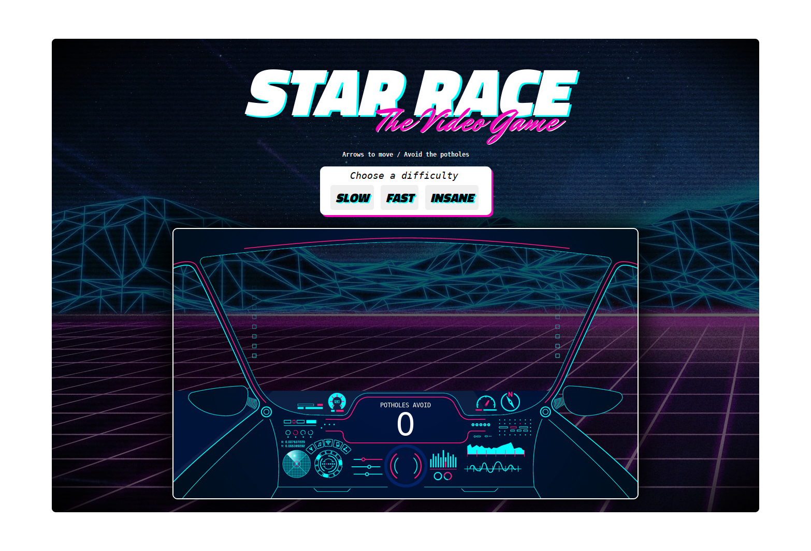

## Getting Started

### Prerequisites

NodeJs is required. I used the package `serve` to run it in the browser through a node server.

#### Cloning the Repository

```
git clone https://github.com/fariasmateuss/star-race.git
```

### Installing

```
  npm install && serve -D
```

_and_

```
  npx serve .
```

_or_

```
./node_modules/.bin/serve .
```

Open the game on localhost or your network address.

# License

[MIT License](/LICENSE)
