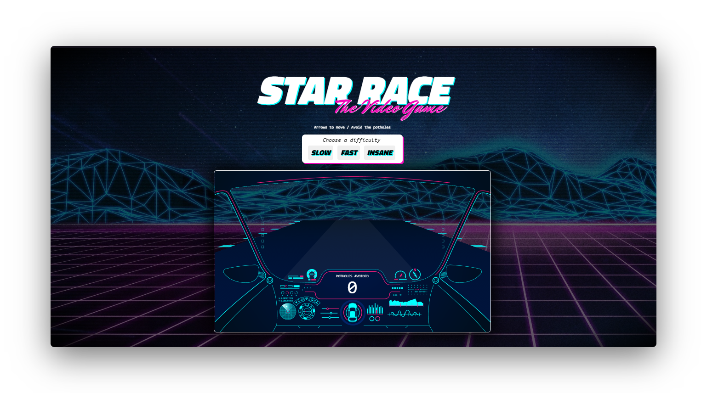

<div align="center">
  
  <h1>
   🚀 <i>STAR RACE</i>
  </h1>
  
  <p>
  Game build with HTML5, CSS3 and JavaScript
  </p>
  
  
  
</div>

## Development setup

```sh
  // Node Js is required. I used the package `serve` to run it in the browser through a node server.
  $ npm init -y 
  $ npm install serve -D 
  $ npx serve . 
```

## Contribution

See the [contribution guide](CONTRIBUTING.md) for more details on how to contribute to this project.

# License
[MIT License](/LICENSE)
